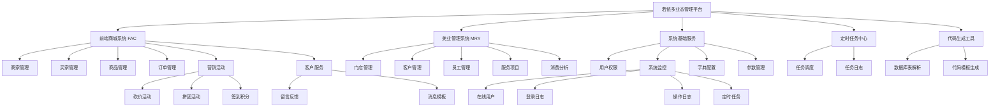

# JB-FAC 后台管理系统 - 项目 Wiki

## 1. 项目概述

**JB-FAC**（JB FACility）是一个基于若依（RuoYi）框架的多业态管理平台后端系统，主要包含**前端商城系统（FAC）**和**美业管理系统（MRY）**两大业务模块，同时集成了若依基础权限框架、定时任务调度和代码生成工具。

- **项目版本**：3.1
- **基础框架**：若依（RuoYi）v3.1.0
- **域名**：`https://www.jbfac.xyz`
- **API 文档地址**：`http://localhost:8080/doc.html?plus=1`

---

## 2. 技术栈

| 类别 | 技术 | 版本 |
|------|------|------|
| 开发语言 | Java | 1.8 |
| 核心框架 | Spring Boot | 2.1.1.RELEASE |
| 持久层 | MyBatis-Spring-Boot-Starter | 2.1.4 |
| 连接池 | Druid | 1.1.13 |
| 权限控制 | Apache Shiro | 1.4.0 |
| 分页插件 | PageHelper | 1.2.5 |
| API 文档 | Knife4j (Swagger增强) | 1.9.6 |
| 通用工具 | Hutool | 5.2.0 |
| 模板引擎 | Thymeleaf | 随Spring Boot |
| 缓存 | Redis | - |
| 数据库 | MySQL | 8.x兼容 |
| 验证码 | Kaptcha | 2.3.2 |
| 构建工具 | Maven | - |

### 2.1 后台管理前端技术栈

本项目后台管理端采用 **RuoYi 前后端不分离版本**，基于传统的服务端渲染模式，前端资源内嵌于 `ruoyi-admin/src/main/resources/` 下。

**整体架构**：jQuery + Bootstrap + Thymeleaf

| 技术 | 用途 | 说明 |
|------|------|------|
| **Thymeleaf** | 服务端模板引擎 | 页面通过 `th:fragment`、`th:href` 等标签服务端渲染 |
| **Bootstrap** | CSS 框架 | 响应式布局与基础样式 |
| **jQuery** | JavaScript 核心库 | DOM 操作与 AJAX 请求 |
| **Bootstrap Table** | 数据表格插件 | 表格展示、分页、排序（含导出、固定列等扩展） |
| **Bootstrap TreeTable** | 树形表格 | 树形结构数据展示 |
| **Layui** | UI 组件库 | 弹层、表单等组件 |
| **Layer** | 弹窗/对话框 | 基于 jQuery 的弹层组件 |
| **jQuery Validate** | 表单验证 | 客户端表单校验 |
| **iCheck** | 复选框/单选框美化 | 自定义复选框与单选框样式 |
| **Select2** | 下拉选择框增强 | 可搜索、多选的下拉框 |
| **BlockUI** | 遮罩层 | 页面加载遮罩与锁定 |
| **ECharts** | 图表可视化 | 数据统计图表展示 |
| **tableExport** | 表格导出 | 表格数据导出为 Excel/CSV 等 |
| **Font Awesome** | 图标字体 | 页面图标 |
| **Animate.css** | CSS 动画 | 页面过渡动画效果 |

**前端资源目录结构**：

```
ruoyi-admin/src/main/resources/
├── static/                     # 静态资源
│   ├── ajax/libs/              # 第三方库 (Bootstrap Table, Validate, iCheck, Layer, Layui 等)
│   ├── css/                    # 全局样式 (Bootstrap, Font Awesome, 自定义样式等)
│   ├── echarts/                # ECharts 图表库
│   ├── fac/                    # FAC 业务静态资源
│   ├── file/                   # 文件资源
│   ├── fonts/                  # 字体文件
│   ├── img/                    # 图片资源
│   ├── js/                     # 核心 JS (jQuery, Bootstrap)
│   ├── mry/                    # MRY 业务静态资源
│   └── ruoyi/                  # 若依框架前端 (ry-ui.css, common.js, ry-ui.js, index.js, login.js)
└── templates/                  # Thymeleaf 模板页面
    ├── include.html            # 公共头尾片段 (CSS/JS 引入)
    ├── index.html              # 首页框架
    ├── login.html              # 登录页
    ├── main.html               # 主内容区
    ├── error/                  # 错误页面
    ├── fac/                    # FAC 业务页面 (19个)
    ├── mry/                    # MRY 业务页面 (12个)
    ├── monitor/                # 系统监控页面
    ├── system/                 # 系统管理页面
    └── tool/                   # 开发工具页面
```

> **注意**：面向 C 端用户的小程序前端为独立项目，不包含在本仓库中，通过 `/fac/client/*` RESTful API 与后端交互。

---

## 3. 项目结构

```
jb_fac-back/
├── ruoyi-admin/          # 启动模块 & 控制器层（Web入口）
├── ruoyi-framework/      # 框架核心配置（Shiro/数据源/AOP等）
├── ruoyi-system/         # 系统基础服务（用户/角色/菜单/字典等）
├── ruoyi-fac/            # 前端商城业务模块（FAC）
├── ruoyi-mry/            # 美业管理业务模块（MRY）
├── ruoyi-quartz/         # 定时任务模块
├── ruoyi-generator/      # 代码生成模块
├── ruoyi-common/         # 通用工具 & 公共类
├── sql/                  # 数据库脚本
├── bin/                  # 构建 & 部署脚本
├── doc/                  # 项目文档
├── logs/                 # 运行日志
├── pom.xml               # Maven 父POM
└── ry.sh                 # Linux部署脚本
```

### 3.1 模块依赖关系

```
ruoyi-admin (启动入口)
  ├── ruoyi-framework (框架配置)
  │     ├── ruoyi-system (系统服务)
  │     │     └── ruoyi-common (通用工具)
  │     └── ruoyi-common
  ├── ruoyi-fac (商城业务)
  │     └── ruoyi-common
  ├── ruoyi-mry (美业业务)
  │     └── ruoyi-common
  ├── ruoyi-quartz (定时任务)
  │     └── ruoyi-common
  └── ruoyi-generator (代码生成)
        └── ruoyi-common
```

---

## 4. 功能架构



---

## 5. 模块详细说明

### 5.1 ruoyi-admin（启动与控制器层）

应用启动入口，包含所有 HTTP 接口的 Controller 层实现。

**启动类**：`com.ruoyi.RuoYiApplication`

**控制器分组**：

| 目录 | 说明 | 主要控制器 |
|------|------|-----------|
| `controller/fac/` | FAC 后台管理接口 | BusinessController, BuyerController, OrderController, ProductController, FacKanjiaController 等 |
| `controller/fac/client/` | FAC 小程序客户端接口 | FacUserController, FacShopController, FacOrderController, FacPayController, FacKanjiaClientController 等 |
| `controller/mry/` | MRY 后台管理接口 | MryCustomerController, MryShopController, MryStaffController, MryDataAnalysisController 等 |
| `controller/system/` | 系统管理接口 | SysUserController, SysRoleController, SysMenuController, SysDeptController, SysDictDataController 等 |
| `controller/monitor/` | 系统监控接口 | SysJobController, SysLogininforController, SysOperlogController, SysUserOnlineController, DruidController 等 |
| `controller/tool/` | 开发工具接口 | GenController, SwaggerController, BuildController 等 |

### 5.2 ruoyi-fac（前端商城业务模块）

FAC 商城系统核心业务逻辑，包含后台管理和微信小程序端两套业务。

**核心包结构**：

```
com.ruoyi.fac/
├── cache/          # 缓存层 (BuyerCache, ProductCache)
├── constant/       # 常量定义
├── domain/         # 业务领域对象 (Business, Buyer, Order, Product 等)
├── enums/          # 枚举类型
│     ├── OrderStatus    # 订单状态
│     ├── ProductStatus  # 商品状态
│     ├── CashStatus     # 提现状态
│     ├── KanjiaStatus   # 砍价状态
│     ├── FocusStatus    # 焦点图状态
│     ├── ScoreTypeEnum  # 积分类型
│     └── FacCode        # 业务编码
├── exception/      # 业务异常
├── mapper/         # MyBatis Mapper 接口 (31个)
├── model/          # MyBatis Generator 生成模型 (38个，含Example类)
├── redis/          # Redis 配置与序列化
├── service/        # 业务服务接口 (23个)
│     └── impl/     # 业务服务实现
├── util/           # 工具类
│     ├── DecimalUtils      # 精度计算
│     ├── FacCommonUtils    # 通用工具
│     ├── FacFileUtils      # 文件操作
│     ├── KJAlgorithmUtil   # 砍价算法
│     ├── TimeUtils         # 时间工具
│     ├── MD5               # MD5加密
│     ├── HttpsGetUtil      # HTTPS请求
│     └── WebUtils          # Web工具
├── vo/             # 视图对象
│     ├── client/   # 小程序端VO
│     ├── cache/    # 缓存VO
│     ├── kanjia/   # 砍价VO
│     ├── wxpay/    # 微信支付VO
│     └── condition/# 查询条件VO
└── wxpay/          # 微信支付工具
      ├── MD5Util         # 支付MD5
      └── PayCommonUtil   # 支付公共工具
```

**核心领域对象**：

| 领域对象 | 说明 |
|---------|------|
| `Business` | 商家 |
| `Buyer` | 买家 |
| `BuyerAddress` | 买家地址 |
| `BuyerBusiness` | 买家-商家关系 |
| `Product` | 商品 |
| `ProductCategory` | 商品分类 |
| `Order` | 订单 |
| `Cash` | 提现 |
| `Channel` | 渠道 |
| `FocusMap` | 焦点图/轮播图 |
| `Menu` | 菜单 |
| `FacProductWriteoff` | 商品核销 |

**核心业务服务**：

| 服务 | 说明 |
|------|------|
| `IBusinessService` | 商家管理 |
| `IBuyerService` | 买家管理 |
| `IBuyerAddressService` | 买家地址管理 |
| `IProductService` | 商品管理 |
| `IProductCategoryService` | 商品分类管理 |
| `IOrderService` | 订单管理 |
| `IPayService` | 支付服务 |
| `ICashService` | 提现管理 |
| `IFacKanjiaService` | 砍价活动 |
| `IFacKanjiaHelperService` | 砍价帮手 |
| `IFacKanjiaJoinerService` | 砍价参与者 |
| `IFacLeaveMessageService` | 留言反馈 |
| `IFocusMapService` | 焦点图管理 |
| `IUserSignService` | 用户签到 |
| `IProductWriteoffService` | 商品核销 |
| `ProductFrontService` | 商品前台服务 |
| `WeiXinService` | 微信服务 |
| `ICacheService` | 缓存服务 |

**小程序端控制器（client）**：

| 控制器 | 说明 |
|--------|------|
| `FacUserController` | 小程序用户（登录/授权） |
| `FacShopController` | 小程序商城首页 |
| `FacOrderController` | 小程序下单/订单列表 |
| `FacPayController` | 小程序支付 |
| `FacKanjiaClientController` | 小程序砍价 |
| `FacBannerController` | 小程序轮播图 |
| `FacConfigController` | 小程序配置 |
| `FacDiscountController` | 小程序优惠 |
| `FacScoreController` | 小程序积分 |
| `FacNoticeController` | 小程序通知 |
| `FacTemplateMsgController` | 小程序模板消息 |

### 5.3 ruoyi-mry（美业管理业务模块）

美业门店管理系统核心业务逻辑。

**核心包结构**：

```
com.ruoyi.mry/
├── cache/          # 缓存层
├── constant/       # 常量定义
├── enums/          # 枚举类型
├── exception/      # 业务异常
├── mapper/         # MyBatis Mapper 接口 (13个)
├── model/          # MyBatis Generator 生成模型 (26个，含Example类)
├── service/        # 业务服务接口 (14个)
│     └── impl/     # 业务服务实现
├── util/           # 工具类
└── vo/             # 视图对象
```

**核心数据模型**：

| 模型 | 说明 |
|------|------|
| `MryShop` | 门店 |
| `MryStaff` | 员工 |
| `MryStaffLeave` | 员工请假 |
| `MryCustomer` | 客户 |
| `MryCustomerCard` | 客户卡项 |
| `MryCustomerInvest` | 客户投资/充值 |
| `MryCustomerPro` | 客户项目/消费 |
| `MryCustomerProItem` | 客户项目明细 |
| `MryCustomerPicture` | 客户图片（对比图） |
| `MryShopCard` | 门店卡项 |
| `MryShopCost` | 门店支出 |
| `MryServicePro` | 服务项目 |
| `MryWorklog` | 工作日志 |

**核心业务服务**：

| 服务 | 说明 |
|------|------|
| `MryShopService` | 门店管理 |
| `MryStaffService` | 员工管理 |
| `MryStaffLeaveService` | 员工请假 |
| `MryCustomerService` | 客户管理 |
| `MryCustomerCardService` | 客户卡项 |
| `MryCustomerInvestService` | 客户充值 |
| `MryCustomerProItemService` | 客户项目明细 |
| `MryServiceProService` | 服务项目 |
| `MryShopCardService` | 门店卡项 |
| `MryShopCostService` | 门店支出 |
| `MryWorklogService` | 工作日志 |
| `MryDataAnalysisService` | 数据分析 |
| `MryPageCommonService` | 分页公共服务 |

### 5.4 ruoyi-system（系统基础服务）

若依框架核心系统服务，提供用户、角色、菜单、部门、字典等基础功能。

**核心包结构**：

```
com.ruoyi.system/
├── domain/    # 系统领域对象 (16个)
├── mapper/    # MyBatis Mapper 接口 (16个)
└── service/   # 系统服务接口 (13个)
```

### 5.5 ruoyi-framework（框架核心配置）

Spring Boot 框架层核心配置，包含安全、数据源、AOP 等基础设施。

**核心包结构**：

```
com.ruoyi.framework/
├── aspectj/      # AOP切面 (数据范围、数据源切换、操作日志)
├── config/       # 配置类 (验证码、Druid、过滤器、国际化等)
├── datasource/   # 动态数据源
├── manager/      # 异步管理器
├── shiro/        # Shiro安全配置 (认证/授权/过滤器/会话)
├── util/         # 框架工具类
└── web/          # Web层配置 (异常处理/域名等)
```

### 5.6 ruoyi-quartz（定时任务模块）

基于 Quartz 的定时任务调度系统。

**核心包结构**：

```
com.ruoyi.quartz/
├── config/   # Quartz配置
├── domain/   # 任务领域对象
├── mapper/   # MyBatis Mapper
├── service/  # 任务服务
├── task/     # 示例任务
└── util/     # Cron工具
```

### 5.7 ruoyi-generator（代码生成模块）

根据数据库表结构自动生成 Java 代码的模块。

**核心包结构**：

```
com.ruoyi.generator/
├── domain/   # 代码生成领域对象
├── mapper/   # MyBatis Mapper
├── service/  # 代码生成服务
└── util/     # 生成工具
```

### 5.8 ruoyi-common（通用工具模块）

提供项目公共工具类、基础实体、注解、常量、枚举等。

**核心包结构**：

```
com.ruoyi.common/
├── annotation/   # 自定义注解 (DataScope, DataSource, Excel, Log)
├── base/         # 基础类 (AjaxResult, BaseEntity)
├── config/       # 全局配置
├── constant/     # 常量类
├── enums/        # 公共枚举
├── exception/    # 异常类
├── json/         # JSON工具
├── page/         # 分页封装
├── reflect/      # 反射工具
├── sql/          # SQL工具
├── support/      # 字符集/转换/格式化
├── utils/        # 通用工具集
│     ├── bean/        # Bean工具
│     ├── file/        # 文件工具
│     ├── http/        # HTTP工具
│     ├── poi/         # Excel导入导出
│     ├── spring/      # Spring工具
│     ├── AddressUtils # 地址解析
│     ├── Arith        # 精确算术
│     ├── DateUtils    # 日期工具
│     ├── IpUtils      # IP工具
│     ├── Md5Utils     # MD5工具
│     ├── MessageUtils # 消息工具
│     ├── ServletUtils # Servlet工具
│     ├── StringUtils  # 字符串工具
│     └── YamlUtil     # YAML工具
└── xss/          # XSS防护
```

---

## 6. 数据库

### 6.1 数据源配置

| 配置项 | 值 |
|-------|-----|
| 数据库 | MySQL |
| 驱动 | `com.mysql.cj.jdbc.Driver` |
| 数据库名 | `ry-pin` |
| 连接池 | Druid |
| 初始连接数 | 5 |
| 最小空闲连接 | 10 |
| 最大活动连接 | 20 |
| 慢SQL阈值 | 1000ms |
| 从数据源 | 默认关闭 |

### 6.2 SQL 脚本

| 文件 | 说明 | 大小 |
|------|------|------|
| `ry.sql` | 若依基础表结构与数据 | 49.6KB |
| `ry_modify.sql` | 若依表结构修改 | 0.1KB |
| `fac.sql` | FAC商城表结构 | 20.9KB |
| `fac_kanjia.sql` | 砍价活动表结构 | 5.4KB |
| `fac_liuyan.sql` | 留言反馈表结构 | 2.4KB |
| `mry.sql` | 美业管理表结构 | 18.6KB |
| `quartz.sql` | Quartz定时任务表结构 | 7.8KB |
| `ruoyi.pdm` | PowerDesigner 数据模型 | 152.8KB |
| `ruoyi.html` | 数据模型HTML文档 | 180.5KB |

---

## 7. 运行环境与配置

### 7.1 环境要求

| 依赖 | 版本要求 |
|------|---------|
| JDK | 1.8 |
| MySQL | 5.7+ / 8.x |
| Redis | 任意稳定版 |
| Maven | 3.x |

### 7.2 核心配置

**应用配置** (`application.yml`)：

| 配置项 | 值 |
|-------|-----|
| 服务端口 | 8080 |
| 文件上传路径 | `D:/profile/` |
| 图片上传路径 | `/opt/fac/picture/` |
| 图片访问路径 | `/images/**` |
| 文件上传限制 | 30MB |
| 热部署 | 开启 |
| XSS过滤 | 开启 |
| 验证码 | 关闭 |
| Redis | localhost:6379 |
| Session超时 | 30分钟 |
| 国际化 | `i18n/messages` |
| Jackson时区 | GMT+8 |

**微信小程序配置**：

| 配置项 | 说明 |
|-------|------|
| `wxapp.fac.appid` | FAC小程序 AppID |
| `wxapp.fac.secret` | FAC小程序 Secret |
| `wxapp.fac.mchId` | 微信支付商户号 |
| `wxapp.fac.mchsecret` | 微信支付商户密钥 |

### 7.3 MyBatis 配置

| 配置项 | 值 |
|-------|-----|
| 类型别名包 | `com.ruoyi` |
| Mapper 扫描路径 | `classpath*:mapper/**/*Mapper.xml` |
| 全局配置文件 | `classpath:mapper/mybatis-config.xml` |
| 分页方言 | MySQL |

---

## 8. 构建与部署

### 8.1 本地开发

```bash
# 1. 导入数据库
#    执行 sql/ry.sql -> sql/fac.sql -> sql/fac_kanjia.sql -> sql/fac_liuyan.sql -> sql/mry.sql -> sql/quartz.sql

# 2. 修改数据库连接配置
#    编辑 ruoyi-admin/src/main/resources/application-druid.yml

# 3. 修改Redis配置（如有密码）
#    编辑 ruoyi-admin/src/main/resources/application.yml

# 4. 启动应用
#    运行 com.ruoyi.RuoYiApplication.main()

# 5. 访问 API 文档
#    http://localhost:8080/doc.html?plus=1
```

### 8.2 Maven 构建

```bash
# Windows 打包
bin\package.bat

# 手动打包
mvn clean package -Dmaven.test.skip=true
```

### 8.3 Linux 部署

```bash
# 启动
./ry.sh start

# 停止
./ry.sh stop

# 重启
./ry.sh restart

# 查看状态
./ry.sh status
```

**JVM 参数**（`ry.sh` 中配置）：
- 堆内存：`-Xms512M -Xmx512M`
- GC 策略：Parallel GC
- 时区：`Asia/Shanghai`
- OOM 自动 HeapDump

---

## 9. 接口文档

项目集成了 **Knife4j**（Swagger 增强），启动后访问：

```
http://localhost:8080/doc.html?plus=1
```

**接口分组**：

| 分组 | 前缀 | 说明 |
|------|------|------|
| 系统管理 | `/system/*` | 用户/角色/菜单/部门/字典等 |
| 系统监控 | `/monitor/*` | 在线用户/日志/Druid/服务器 |
| 开发工具 | `/tool/*` | 代码生成/Swagger |
| FAC后台 | `/fac/*` | 商城后台管理 |
| FAC客户端 | `/fac/client/*` | 小程序端接口 |
| MRY后台 | `/mry/*` | 美业后台管理 |

---

## 10. 安全机制

| 机制 | 说明 |
|------|------|
| 认证授权 | Apache Shiro（Session模式） |
| 密码策略 | 错误5次锁定10分钟 |
| XSS防护 | 全局XSS过滤器（排除通知接口） |
| 验证码 | 支持数学计算和字符两种类型（默认关闭） |
| 数据范围 | 基于AOP的数据权限过滤（@DataScope） |
| 操作日志 | 基于AOP的操作日志记录（@Log） |
| 多数据源 | 支持@DataSource注解切换主从数据源 |

---

## 11. 缓存设计

| 缓存 | 说明 |
|------|------|
| Redis | Session存储、业务缓存 |
| BuyerCache | 买家信息缓存 |
| ProductCache | 商品信息缓存 |
| EhCache | 本地二级缓存 |

**Redis 配置**：
- 序列化：自定义 `ObjectRedisSerializer`
- 连接超时：60秒
- 数据库：db0

---

## 12. 微信支付

FAC 模块集成了微信小程序支付功能：

- **支付工具**：`PayCommonUtil`、`MD5Util`
- **支付服务**：`IPayService`
- **微信适配**：`WechatAdapterService`、`WeiXinService`
- **支付流程**：小程序下单 → 统一下单 → 微信支付 → 回调通知 → 订单状态更新

---

## 13. 砍价活动

FAC 模块的营销功能之一，包含砍价算法和完整的砍价流程：

- **砍价算法**：`KJAlgorithmUtil` — 控制砍价金额分布
- **砍价发起**：`FacKanjia` — 砍价活动配置
- **砍价参与**：`FacKanjiaJoiner` — 参与砍价的用户
- **砍价助力**：`FacKanjiaHelper` — 帮砍价的用户
- **状态流转**：`KanjiaStatus` 枚举 — 未开始/进行中/已结束

---

## 14. Mapper XML 映射文件

### FAC 模块 Mapper

| Mapper XML | 说明 |
|-----------|------|
| `BusinessMapper.xml` | 商家数据映射 |
| `BuyerMapper.xml` | 买家数据映射 |
| `BuyerAddressMapper.xml` | 买家地址数据映射 |
| `BuyerBusinessMapper.xml` | 买家-商家关系映射 |
| `ProductMapper.xml` | 商品数据映射 |
| `ProductCategoryMapper.xml` | 商品分类数据映射 |
| `OrderMapper.xml` | 订单数据映射 |
| `CashMapper.xml` | 提现数据映射 |
| `ChannelMapper.xml` | 渠道数据映射 |
| `FocusMapMapper.xml` | 焦点图数据映射 |
| `MenuMapper.xml` | 菜单数据映射 |
| `FacProductWriteoffMapper.xml` | 商品核销数据映射 |

---

## 15. 关键枚举说明

| 枚举 | 模块 | 说明 |
|------|------|------|
| `OrderStatus` | FAC | 订单状态（待支付/已支付/已发货/已完成/已取消等） |
| `ProductStatus` | FAC | 商品状态（上架/下架） |
| `CashStatus` | FAC | 提现状态（申请中/已通过/已拒绝） |
| `KanjiaStatus` | FAC | 砍价活动状态（未开始/进行中/已结束） |
| `FocusStatus` | FAC | 焦点图状态（启用/禁用） |
| `ScoreTypeEnum` | FAC | 积分类型（签到/购物/砍价等） |
| `BusinessStatus` | Common | 业务操作状态 |
| `BusinessType` | Common | 业务操作类型 |
| `UserStatus` | Common | 用户状态（正常/停用） |
| `OnlineStatus` | Common | 在线状态 |
| `DataSourceType` | Common | 数据源类型（主库/从库） |

---

## 16. 项目特性总结

- **多业态架构**：FAC商城 + MRY美业，业务模块独立、可扩展
- **微信生态深度集成**：小程序登录、微信支付、模板消息推送
- **营销工具丰富**：砍价活动、签到积分、拼团等
- **美业专业功能**：客户档案、消费项目管理、客户对比图、数据分析
- **若依框架完整功能**：用户权限、数据范围、操作日志、代码生成
- **前后端架构**：后台管理采用 Thymeleaf + jQuery + Bootstrap 服务端渲染模式，C端小程序通过 RESTful API 交互
